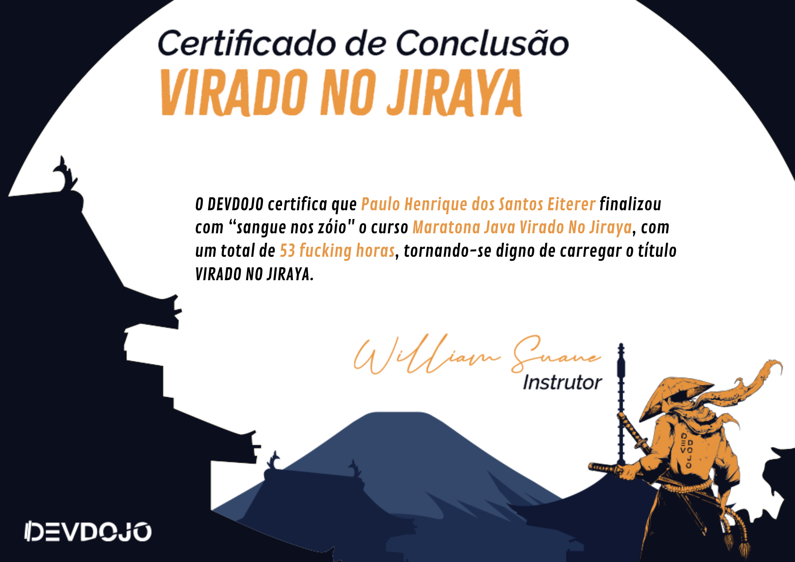

<h3 align="center"></h3>
 
<h1 align="center">Maratona Java Virado No Jiraya</h1>

Este é um repositório que criei a partir das aulas que ia assistindo do canal DevDojo (link da playlist na descrição do repositório), 
a cada vídeo que assistia eu comitava o que me foi ensinado no vídeo, obviamente não está totalmente de acordo com a playlist e organizado, pois também foi utilizado para 
aprender a usar o GitHub de forma geral.

Caso tenha interesse em saber o que o curso aborda vou deixar uma lista aqui em baixo. Esta informação foi tirada do repositório original
do DevDojo. *Repositório original -->* [☕](https://github.com/devdojobr/maratona-java-virado-no-jiraya)

 

## Lista dos vídeos resumida
1. Maratona Java 01 - O que esperar do curso
1. Maratona Java 02 - Como Java Funciona
1. Maratona Java 03 - Fazendo o download da JDK 15
1. Maratona Java 04 - Configurando variaveis de ambiente
1. Maratona Java 05 - Executando compilação manualmente
1. Maratona Java 06 - Download da IDE IntelliJ Community
1. Maratona Java 07 - Conhecendo a IDE IntelliJ Community
1. Maratona Java 08 - Organizando o código em pacotes
1. Maratona Java 09 - Comentários
1. Maratona Java 10 - Tipos primitivos 
1. Maratona Java 15 - Operadores 
1. Maratona Java 20 - Estruturas Condicionais
1. Maratona Java 32 - Arrays
1. Maratona Java 36 - Arrays Multidimensionais 
1. Maratona Java 39 - Orientação Objetos
1. Maratona Java 95 - Exceções
1. Maratona Java 106 - Classes Utilitárias
1. Maratona Java 161 - Coleções
1. Maratona Java 183 - Generics
1. Maratona Java 189 - Classes Internas
1. Maratona Java 193 - Parametrizando comportamentos
1. Maratona Java 195 - Lambdas
1. Maratona Java 198 - Method Reference
1. Maratona Java 201 - Optional
1. Maratona Java 203 - Streams
1. Maratona Java 220 - Threads
1. Maratona Java 229 - Concorrência
1. Maratona Java 246 - Padrões de Projeto
1. Maratona Java 252 - JDBC
1. Maratona Java 280 - Testes unitários com jUnit
1. Maratona Java 282 - Atualizando JDK
1. Maratona Java 283 - Record Class
1. Maratona Java 284 - Pattern Matching for instanceof
